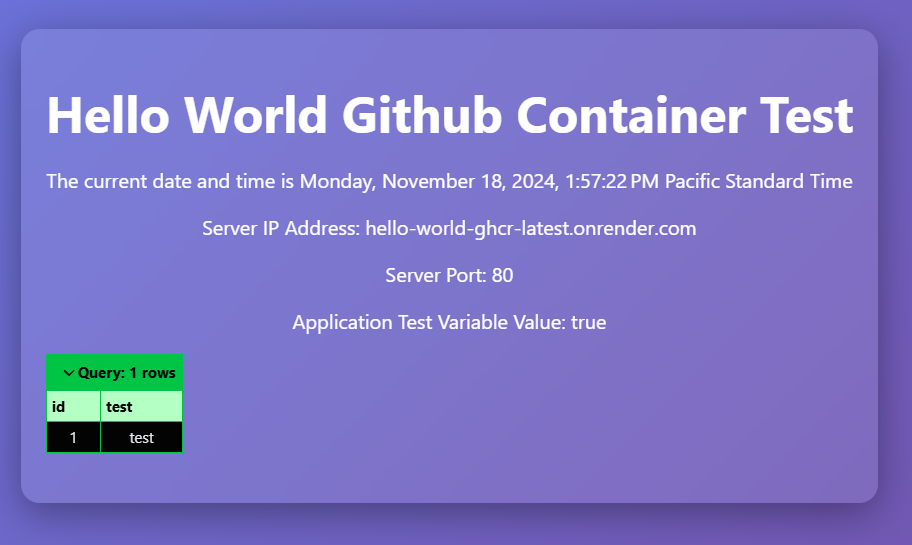

# Part Two: Boxlang, AWS Database, and Environment Variables

In this part of the series, the app will query an AWS RDS PostgreSQL database. Be aware that Amazon will require a credit card, but you will have a free tier option that will last 12 months from creation.

---

## Requirements

0. The code from [Part One](https://github.com/webmandman/boxlang-ghcr-test)
1. [Amazon RDS Database](https://aws.amazon.com/free/database/)
2. Database Host Endpoint
3. Database Username and Password
4. Forgebox Module: [commandbox-dotenv](https://forgebox.io/view/commandbox-dotenv)
5. Environment Variables for database password

## Steps to Configure and Deploy

### 1. Create a database in AWS

1. Login to the AWS Console and go to RDS Services
2. Create a new database. All settings I do not mention you can leave alone or in their default state. Make sure **Estimated monthly costs** states its RDS Free Tier and/or there is zero cost estimated. 
    1. Choose the Standard Create method
    2. Choose PostgreSQL or any DB of your choice
    3. Under Templates, choose Free Tier
    4. DB Instance: Make this very unique, e.g., boxlang-test1
    5. Master username, e.g., main
    6. Credentials management: Select Self Managed (auto generate or create your own)
    7. Instance configuration: Select t3g.micro or t4g.micro (Free Tier has few options available)
    8. Storage: Allocate 20GB or whatever you think you will need. After 12 months of free-tier, you will begin to accrue charges for this.
    9. Compute resource: Don't connect to an EC2
    10. Public access: Yes
    11. VPC security group: Choose existing, which "default" should already be selected for you.
    12. Database authentication: Password auth.
    13. Monitoring: free-tier
    14. Additional configuration: Enter a name for the initial database, e.g., postgres
    15. Click the Create database button.

3. Database security

    1. Once the database is ready to use, click on the database name and under **Connectivity & security** click on the default VPC security group (the link will look like "sg-0c27892a8372ah"). 
    2. In the list of groups, you should only see one. Click on the same name again.
    3. Under Inbound rules, make sure the version is `IPv4`, Type is `All traffic`, Protocol is `All`, Port range is `All`, and Source is `0.0.0.0/0`
    4. If the rule is not exactly that, then edit the rule to match the settings I specified. Of course, you can set it to whatever you want. For instance, you can get a range of IPs from your Web Service at Render.com and specify only those IPs in this Security rule so that anything/anyone else is blocked.

### 2. Create a Datasource for your boxlang application

1. Open Application.bx and add your datasource:
```
class {
	this.name = "boxlang test app";

	this.datasources = {
        "NAME_YOUR_DATASOURCE" = {
            "database": "YOUR_INITIAL_DATABASE_NAME_FROM_STEP_1.14",
            "driver": "postgresql",
            "host": "YOUR_DATABASE_ENDPOINT_URL",
            "password": "${env.DB_PASSWORD}",
            "port": "YOUR_DATABASE_PORT",
            "username": "YOUR_DATABASE_USERNAME"
        }
    }

	function onApplicationStart(){
		application.test = true;
	}

}
```
  1. Name your datasource, and use this name in your query.
  2. The database setting is the same name you gave your initial database from step 1.14.
  3. The driver setting should match the database base type you created. Supported types:
    - postgresql
    - mysql
    - mssql
    - hypersql
    - oracle
    - mariadb
    - derby
  4. Host url and port are found under Connectivity & Security in your database's settings page in AWS.
  5. The password setting value is set to `${env.DB_PASSWORD}`. Leave it as is. Boxlang will expand this to the environment variable you will set in the next steps.
  6. The username setting is the same as the name in step 2.5

  ### 3. Create your first PostgreSQL database table using pgAdmin

  Since this example application is built with PostgreSQL we are using the database client desktop app called pgAdmin. You can use which ever client is best for you or your database type.

  In pgAdmin I connected to my database with all the same settings from step 2, and ran the following script to create my first table:

```
CREATE TABLE IF NOT EXISTS public.testtable
(
    id integer NOT NULL,
    test text COLLATE pg_catalog."default" NOT NULL,
    CONSTRAINT testtable_pkey PRIMARY KEY (id)
)

TABLESPACE pg_default;

ALTER TABLE IF EXISTS public.testtable
    OWNER to main;
```
  In pgAdmin I also added one record to the new table.

### 4. Add a query to your application

Open up index.bxm, and add one query to the top of the file and one dump in your html body:

```
<bx:script>
qry = QueryExecute(
    sql="select * from testtable;",
    options={datasource:"NAME_YOUR_DATASOURCE"}
)
</bx:script>

<!DOCTYPE html>
...
<body>
    <div class="container">
        ...
        <bx:dump var="#qry#" />
    </div>
</body>
</html>
```

### 5. Password Env Var for Local Commandbox Testing

1.  Create an .env file at the root of your application and add this line `DB_PASSWORD=******` with your actual password.
2. Run this commandbox command `install commandbox-dotenv` so that commandbox knows you need your environment variables loaded into the server application.
3. Run this commandbox to install the postgresql boxlang module `install bx-postgresql`. To ensure you never forget to install this module lets user the `onServerInitialInstall` script. Make sure your server.json file looks like this:
```
{
    "app":{
        "cfengine":"boxlang"
    },
    "JVM": {
        "javaVersion":"openjdk21_jdk"
    },
    "web":{
        "welcomeFiles":"index.bxm"
    },
    "scripts":{
        "onServerInitialInstall":"install bx-postgresql"
    }
}
```
4. Run this commandbox command to start your server `server start`

Recap: To test locally with commandbox all you needed was 
1. Datasource configured in Application.bx
2. A query and dump in your index.bxm 
3. The commandbox module `commandbox-dotenv`
4. and of course your env variable added to your .env file 
5. Install the boxland module for postgresql
6. Start the server

### 6. Pass Env Var for Local Docker Testing

1. dockerfile requires zero changes at this point.
2. The application is ready to run a query.
3. We simply need to build a docker image and run it with the DB_PASSWORD environment variable
4. If you don't already have Docker Desktop with terminal access installed go do that now.
5. Run this command from the root of your application to build your image from the dockerfile `docker built -t MY_DOCKER_IMAGE_NAME .`
6. Run this command to spin up the container `docker un --name MY_CONTAINER_NAME -e DB_PASSWORD=******** -e BOXLANG_MODULES=bx-postgresql -p :8080 MY_DOCKER_IMAGE_NAME_FROM_PREVIOUS_STEP`. Notice we are passing 2 environment variables to the container (the password and the required module for our query to work). Also the -p param is for the host port and the container port, but I only specified the container port 8080 - docker will assign a random port number on the host(your computer).

### 7. Pass Env Var for Render.com Production Deployment

Reminder, Part one of this series details how to setup this app for Github and Render.com

1. Log into your Render.com account. 
2. Go to your Web Service for this app. 
3. Under Environment, add your environment variables and SAVE ONLY.
  1. Key: `BOXLANG_MODULES`, Value: `bx-postgresql`
  2. Key: `DB_PASSWORD`, Value: `*****************`
4. Now back in your codebase, git commit your changes. The github action for your repo will start and kick off the deployment process of your containerized boxlang application. Both the github action and the deployment event at Render.com will provide details of the process and if there are any errors each platform will provide adequate details that will help you figure out what went wrong. 

## Conclusion

What did you accomplish?
1. Create a free-tier rds database in Amazon Web Services
2. Create a database table with sql script
3. Use environment variables for 3 setups. 
    1. Local commandbox testing
    2. Local docker container testing
    3. Render.com (Production)
4. How to extend the base boxlang:miniserver docker image by install postgresql commandbox module leveraging the container environment variable `BOXLANG_MODULES`. In steps 6.6 and 7.3.1 this is where you tell commandbox onStartup to download and install the postgresql module into the server. In the future, I'd like to look into creating my own docker images that already include all the dependencies and not only that also warm up the server to improve the deployment speed from over 1 minute to less than 20 seconds.
5. How to use the commandbox install script `onServerInitialinstall`
6. How to use a couple docker terminal commands





